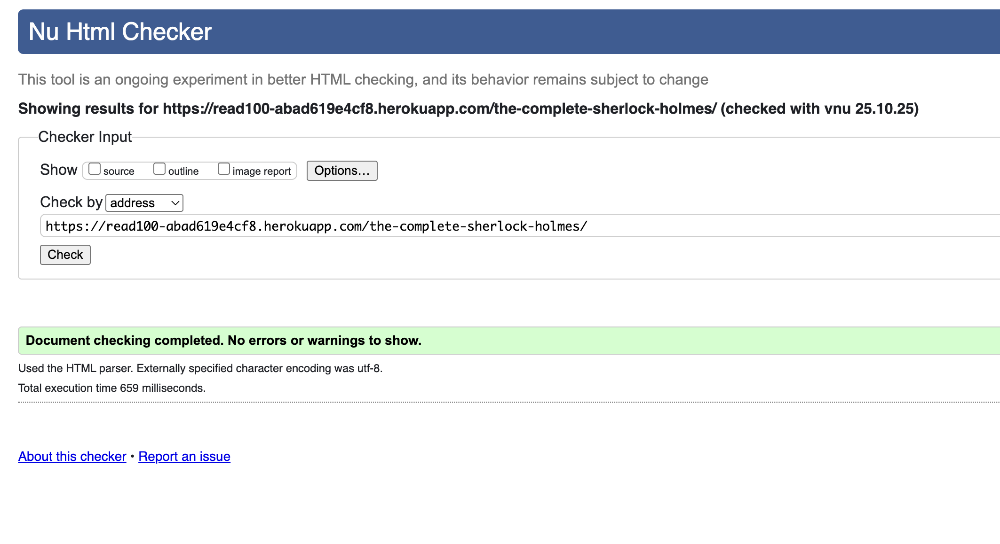
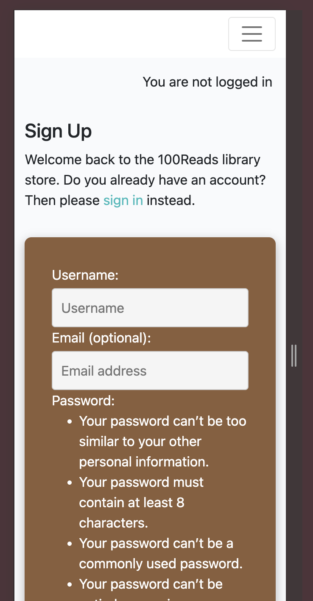
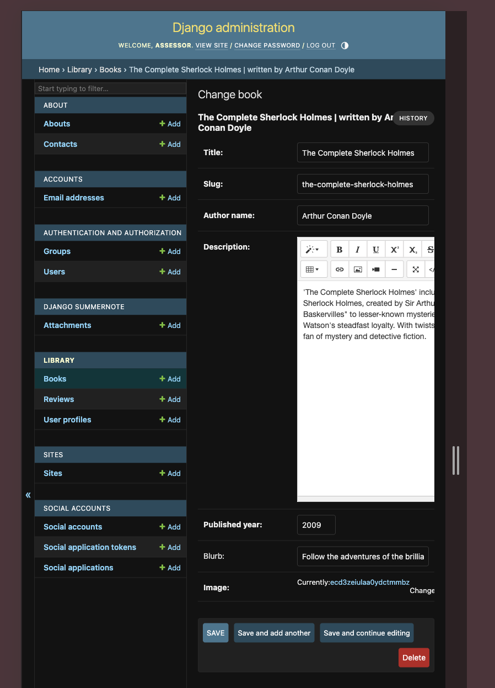
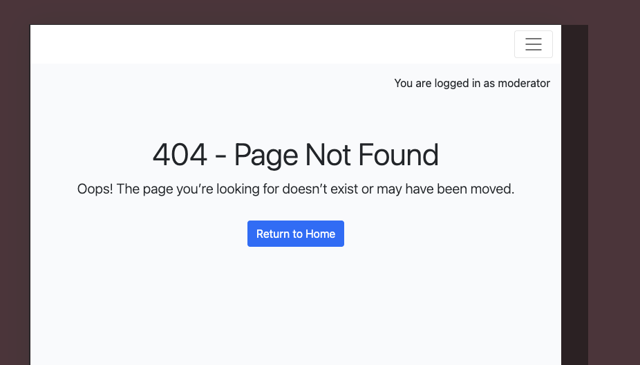

# Testing

> [!NOTE]  
> Return back to the [README.md](README.md) file.

## Code Validation

### HTML

I have used the recommended [HTML W3C Validator](https://validator.w3.org) to validate all of my HTML files.

| Directory | File | URL | Screenshot | Notes |
| --- | --- | --- | --- | --- |
| about | [about.html](https://github.com/RadwanDuadu/100Reads/blob/main/about/templates/about/about.html) | [Link](https://validator.w3.org/nu/?doc=https%3A%2F%2Fread100-abad619e4cf8.herokuapp.com%2Fabout) |  | No Notes |
| library | [book_detail.html](https://github.com/RadwanDuadu/100Reads/blob/main/library/templates/library/book_detail.html) | [Link](https://validator.w3.org/nu/?doc=https%3A%2F%2Fread100-abad619e4cf8.herokuapp.com%2Fharry-potter-and-the-prisoner-of-azkaban-harry-potter-3%2F) |  | No Notes |
| library | [index.html](https://github.com/RadwanDuadu/100Reads/blob/main/library/templates/library/index.html) | [Link](https://validator.w3.org/nu/?doc=https%3A%2F%2Fread100-abad619e4cf8.herokuapp.com%2F) |  | No Notes |
| library | [dashboard.html](https://github.com/RadwanDuadu/100Reads/blob/main/library/templates/moderator/dashboard.html) | Manual Input |  | No Notes |
| templates | [login.html](https://github.com/RadwanDuadu/100Reads/blob/main/templates/account/login.html) | [Link](https://validator.w3.org/nu/?doc=https%3A%2F%2Fread100-abad619e4cf8.herokuapp.com%2Faccounts%2Flogin) |  | No Notes |
| templates | [logout.html](https://github.com/RadwanDuadu/100Reads/blob/main/templates/account/logout.html) | [Link](https://validator.w3.org/nu/?doc=https%3A%2F%2Fread100-abad619e4cf8.herokuapp.com%2Faccounts%2Flogout%2F) |  | No Notes |
| templates | [signup.html](https://github.com/RadwanDuadu/100Reads/blob/main/templates/account/signup.html) | [Link](https://validator.w3.org/nu/?doc=https%3A%2F%2Fread100-abad619e4cf8.herokuapp.com%2Faccounts%2Fsignup%2F) |  | No Notes |

### CSS

I have used the recommended [CSS Jigsaw Validator](https://jigsaw.w3.org/css-validator) to validate all of my CSS files.

| Directory | File | URL | Screenshot | Notes |
| --- | --- | --- | --- | --- |
| static | [style.css](https://github.com/RadwanDuadu/100Reads/blob/main/static/css/style.css) | [Link](https://jigsaw.w3.org/css-validator/validator?uri=https%3A%2F%2Fread100-abad619e4cf8.herokuapp.com%2F&profile=css3svg&usermedium=all&warning=1&vextwarning=&lang=en) |  | No Notes |

### JavaScript

I have used the recommended [JShint Validator](https://jshint.com) to validate all of my JS files.

| Directory | File | URL | Screenshot | Notes |
| --- | --- | --- | --- | --- |
| static | [reviews.js](https://github.com/RadwanDuadu/100Reads/blob/main/static/js/reviews.js) |  |  | 1 Warning due to calling variables outside of script |

### Python

I have used the recommended [PEP8 CI Python Linter](https://pep8ci.herokuapp.com) to validate all of my Python files.

| Directory | File | URL | Screenshot | Notes |
| --- | --- | --- | --- | --- |
| about | [admin.py](https://github.com/RadwanDuadu/100Reads/blob/main/about/admin.py) | [PEP8 CI Link](https://pep8ci.herokuapp.com/https://raw.githubusercontent.com/RadwanDuadu/100Reads/main/about/admin.py) |  | No errors |
| about | [apps.py](https://github.com/RadwanDuadu/100Reads/blob/main/about/apps.py) | [PEP8 CI Link](https://pep8ci.herokuapp.com/https://raw.githubusercontent.com/RadwanDuadu/100Reads/main/about/apps.py) |  | No errors |
| about | [forms.py](https://github.com/RadwanDuadu/100Reads/blob/main/about/forms.py) | [PEP8 CI Link](https://pep8ci.herokuapp.com/https://raw.githubusercontent.com/RadwanDuadu/100Reads/main/about/forms.py) |  | No errors |
| about | [models.py](https://github.com/RadwanDuadu/100Reads/blob/main/about/models.py) | [PEP8 CI Link](https://pep8ci.herokuapp.com/https://raw.githubusercontent.com/RadwanDuadu/100Reads/main/about/models.py) |  | No errors |
| about | [test_forms.py](https://github.com/RadwanDuadu/100Reads/blob/main/about/test_forms.py) | [PEP8 CI Link](https://pep8ci.herokuapp.com/https://raw.githubusercontent.com/RadwanDuadu/100Reads/main/about/test_forms.py) |  | No errors |
| about | [test_views.py](https://github.com/RadwanDuadu/100Reads/blob/main/about/test_views.py) | [PEP8 CI Link](https://pep8ci.herokuapp.com/https://raw.githubusercontent.com/RadwanDuadu/100Reads/main/about/test_views.py) |  | No errors |
| about | [tests.py](https://github.com/RadwanDuadu/100Reads/blob/main/about/tests.py) | [PEP8 CI Link](https://pep8ci.herokuapp.com/https://raw.githubusercontent.com/RadwanDuadu/100Reads/main/about/tests.py) |  | No errors |
| about | [urls.py](https://github.com/RadwanDuadu/100Reads/blob/main/about/urls.py) | [PEP8 CI Link](https://pep8ci.herokuapp.com/https://raw.githubusercontent.com/RadwanDuadu/100Reads/main/about/urls.py) |  | No errors |
| about | [views.py](https://github.com/RadwanDuadu/100Reads/blob/main/about/views.py) | [PEP8 CI Link](https://pep8ci.herokuapp.com/https://raw.githubusercontent.com/RadwanDuadu/100Reads/main/about/views.py) |  | No errors |
| library | [apps.py](https://github.com/RadwanDuadu/100Reads/blob/main/library/apps.py) | [PEP8 CI Link](https://pep8ci.herokuapp.com/https://raw.githubusercontent.com/RadwanDuadu/100Reads/main/library/apps.py) |  | No errors |
| library | [admin.py](https://github.com/RadwanDuadu/100Reads/blob/main/library/admin.py) | [PEP8 CI Link](https://pep8ci.herokuapp.com/https://raw.githubusercontent.com/RadwanDuadu/100Reads/main/library/admin.py) |  | No errors |
| library | [forms.py](https://github.com/RadwanDuadu/100Reads/blob/main/library/forms.py) | [PEP8 CI Link](https://pep8ci.herokuapp.com/https://raw.githubusercontent.com/RadwanDuadu/100Reads/main/library/forms.py) |  | No errors |
| library | [models.py](https://github.com/RadwanDuadu/100Reads/blob/main/library/models.py) | [PEP8 CI Link](https://pep8ci.herokuapp.com/https://raw.githubusercontent.com/RadwanDuadu/100Reads/main/library/models.py) |  | No errors |
| library | [test_forms.py](https://github.com/RadwanDuadu/100Reads/blob/main/library/test_forms.py) | [PEP8 CI Link](https://pep8ci.herokuapp.com/https://raw.githubusercontent.com/RadwanDuadu/100Reads/main/library/test_forms.py) |  | No errors |
| library | [test_views.py](https://github.com/RadwanDuadu/100Reads/blob/main/library/test_views.py) | [PEP8 CI Link](https://pep8ci.herokuapp.com/https://raw.githubusercontent.com/RadwanDuadu/100Reads/main/library/test_views.py) |  | No errors |
| library | [tests.py](https://github.com/RadwanDuadu/100Reads/blob/main/library/tests.py) | [PEP8 CI Link](https://pep8ci.herokuapp.com/https://raw.githubusercontent.com/RadwanDuadu/100Reads/main/library/tests.py) |  | No errors |
| library | [urls.py](https://github.com/RadwanDuadu/100Reads/blob/main/library/urls.py) | [PEP8 CI Link](https://pep8ci.herokuapp.com/https://raw.githubusercontent.com/RadwanDuadu/100Reads/main/library/urls.py) |  | No errors |
| library | [views.py](https://github.com/RadwanDuadu/100Reads/blob/main/library/views.py) | [PEP8 CI Link](https://pep8ci.herokuapp.com/https://raw.githubusercontent.com/RadwanDuadu/100Reads/main/library/views.py) |  | No errors |
|  | [manage.py](https://github.com/RadwanDuadu/100Reads/blob/main/manage.py) | [PEP8 CI Link](https://pep8ci.herokuapp.com/https://raw.githubusercontent.com/RadwanDuadu/100Reads/main/manage.py) |  | No errors |
| read_list | [settings.py](https://github.com/RadwanDuadu/100Reads/blob/main/read_list/settings.py) | [PEP8 CI Link](https://pep8ci.herokuapp.com/https://raw.githubusercontent.com/RadwanDuadu/100Reads/main/read_list/settings.py) |  | No errors |
| read_list | [urls.py](https://github.com/RadwanDuadu/100Reads/blob/main/read_list/urls.py) | [PEP8 CI Link](https://pep8ci.herokuapp.com/https://raw.githubusercontent.com/RadwanDuadu/100Reads/main/read_list/urls.py) |  | No errors |

## Responsiveness

I've tested my deployed project to check for responsiveness issues.

| Page | Mobile | Tablet | Desktop | Notes |
| --- | --- | --- | --- | --- |
| Register |  |  |  | Works as expected |
| Login |  |  |  | Works as expected |
| Home |  |  |  | Works as expected |
| Dashboard |  |  |  | Works as expected Moderator dashboard and mobile and tablet will require scrolling to the approve/delete buttons|
| Logout |  |  |  | Works as expected |
| Blook Detail |  |  |  | Works as expected |
| About |  |  |  | Works as expected |
| Add Book |  |  |  | Works as expected |
| Edit Book|  |  |  | Works as expected |
| 404 |  |  |  | Works as expected |

## Browser Compatibility

I've tested my deployed project on multiple browsers to check for compatibility issues.

| Page | Chrome | Firefox | Safari | Notes |
| --- | --- | --- | --- | --- |
| Register |  |  |  | Works as expected |
| Login |  |  |  | Works as expected |
| Logout |  |  |  | Works as expected |
| Home |  |  |  | Works as expected |
| Book Detail |  |  |  | Works as expected |
| Dashboard |  |  |  | Works as expected |
| Add Book |  |  |  | Works as expected |
| Edit Book |  |  |  | Works as expected |
| About |  |  |  | Works as expected |
| 404 |  |  |  | Works as expected |

## Lighthouse Audit

I've tested my deployed project using the Lighthouse Audit tool to check for any major issues. Some warnings are outside of my control, and mobile results tend to be lower than desktop.

| Page | Mobile | Desktop |
| --- | --- | --- |
| Register |  |  |
| Login |  |  |
| Logout |  |  |
| Dashboard |  |  |
| Home |  |  |
| Add Book |  |  |
| Edit Book |  |  |
| Book Detail |  |  |
| About|  |  |
| 404 |  |  |

## Defensive Programming

Defensive programming was manually tested with the below user acceptance testing:

| Page                          | Expectation                                                                                      | Test                                                      | Result                                                                     | Screenshot                                                       |
| ----------------------------- | ------------------------------------------------------------------------------------------------ | --------------------------------------------------------- | -------------------------------------------------------------------------- | ---------------------------------------------------------------- |
| **Home Page (Library Index)** | Expected to display a paginated list of all available books with title, author, and cover image. | Accessed the home page as a guest user.                   | All books were displayed with correct details, pagination worked properly. |             |
|                               | Expected to allow navigation to individual book detail pages.                                    | Clicked on a book title or image.                         | Redirected to the correct book detail page.                                |        |
| **Book Detail Page**          | Expected to display detailed book information (title, author, description, year, cover).         | Opened a book detail page.                                | All book details were displayed accurately.                                |            |
|                               | Expected to allow logged-in users to submit reviews.                                             | Logged in, submitted a review with valid text and rating. | Review was submitted successfully and displayed as “pending approval.”     |             |
|                               | Expected to restrict review submission for unauthenticated users.                                | Tried submitting a review while logged out.               | Redirected to login page as expected.                                      |  |
|                               | Expected to display approved reviews and average rating.                                         | Viewed a book with approved reviews.                      | Approved reviews and star ratings were displayed correctly.                |           |
| **Moderator Dashboard**       | Expected to allow moderators to view all submitted reviews.                                      | Logged in as moderator and accessed the dashboard.        | All reviews were displayed in a responsive table.                          |          |
|                               | Expected to allow moderators to approve pending reviews.                                         | Clicked “Approve” on a pending review.                    | Review was marked as approved and removed from pending list.               |         |
|                               | Expected to allow moderators to delete any review.                                               | Clicked “Delete” on a review.                             | Review was deleted successfully and removed from the dashboard.            |          |
| **User Review Management**    | Expected to allow users to delete their own reviews.                                             | Logged in and deleted a personal review.                  | Review was deleted successfully.                                           |     |
|                               | Expected to restrict users from deleting others’ reviews.                                        | Attempted to delete another user’s review.                | Access was denied with an error message.                                   |          |
| **User Authentication**       | Expected to allow users to register for a new account.                                           | Filled in the registration form with valid details.       | Account was created successfully and redirected to login.                  |               |
|                               | Expected to allow existing users to log in.                                                      | Logged in using valid credentials.                        | Login was successful and redirected to home page.                          |                  |
|                               | Expected to prevent login with invalid credentials.                                              | Tried logging in with incorrect password.                 | Error message displayed; login denied.                                     |             |
|                               | Expected to log out users securely.                                                              | Clicked “Logout” and tried accessing a restricted page.   | Logged out successfully; access was denied to restricted pages.            |                 |
| **About Page**                | Expected to display information about the library and a contact form.                            | Opened About page and filled contact form.                | Page loaded correctly; message was sent and confirmation shown.            |           |
| **Access Control**            | Expected to block non-moderators from accessing the moderator dashboard.                         | Tried accessing `/moderator/` as a normal user.           | Redirected to home or access denied message shown.                         |          |
| **404 Error Page**            | Expected to display a custom 404 page for non-existent routes.                                   | Visited invalid URL (e.g., `/invalid-page/`).             | Custom 404 error page displayed correctly.                                 |                    |

## User Story Testing

⚠️ INSTRUCTIONS ⚠️

Testing User Stories is actually quite simple, once you've already got the stories defined on your README.

Most of your project's **Features** should already align with the **User Stories**, so this should be as simple as creating a table with the User Story, matching with the re-used screenshot from the respective Feature.

⚠️ --- END --- ⚠️

| Target | Expectation | Outcome | Screenshot |
| --- | --- | --- | --- |
| As a blog owner | I would like to create new blog posts with a title, featured image, and content | so that I can share my experiences with my audience. |  |
| As a blog owner | I would like to update existing blog posts | so that I can correct or add new information to my previous stories. |  |
| As a blog owner | I would like to delete blog posts | so that I can remove outdated or irrelevant content from my blog. |  |
| As a blog owner | I would like to retrieve a list of all my published blog posts | so that I can manage them from a central dashboard. |  |
| As a blog owner | I would like to preview a post as draft before publishing it | so that I can ensure formatting and content appear correctly. |  |
| As a blog owner | I would like to review comments before they are published | so that I can filter out spam or inappropriate content. |  |
| As a blog owner | I would like to approve or reject comments from users | so that I can maintain control over the discussion on my posts. |  |
| As a blog owner | I would like to view a list of all comments (both approved and pending) | so that I can manage user engagement effectively. |  |
| As a blog owner | I would like to edit or delete user comments | so that I can clean up or remove inappropriate responses after they've been posted. |  |
| As a registered user | I would like to log in to the site | so that I can leave comments on blog posts. |  |
| As a registered user | I would like to register for an account | so that I can become part of the community and engage with the blog. |  |
| As a registered user | I would like to leave a comment on a blog post | so that I can share my thoughts or ask questions about the owner's experiences. |  |
| As a registered user | I would like my comment to show my name and the timestamp | so that others can see who I am and when I left the comment. |  |
| As a registered user | I would like to receive a notification or message saying my comment is pending approval | so that I understand it hasn't been posted immediately. |  |
| As a registered user | I would like to edit or delete my own comments | so that I can fix mistakes or retract my statement. |  |
| As a guest user | I would like to read blog posts without registering | so that I can enjoy the content without needing to log in. |  |
| As a guest user | I would like to browse past posts | so that I can explore the blog's full content history. |  |
| As a guest user | I would like to register for an account | so that I can participate in the community by leaving comments on posts. |  |
| As a guest user | I would like to see the names of other commenters on posts | so that I can get a sense of community interaction before registering. |  |
| As a user | I would like to see a 404 error page if I get lost | so that it's obvious that I've stumbled upon a page that doesn't exist. |  |

## Automated Testing

I have conducted a series of automated tests on my application.

> [!NOTE]  
> I fully acknowledge and understand that, in a real-world scenario, an extensive set of additional tests would be more comprehensive.

### Python (Unit Testing)

⚠️ INSTRUCTIONS ⚠️

Adjust the code below (file names, function names, etc.) to match your own project files/folders. Use these notes loosely when documenting your own Python Unit tests, and remove/adjust where applicable.

⚠️ SAMPLE ⚠️

I have used Django's built-in unit testing framework to test the application functionality. In order to run the tests, I ran the following command in the terminal each time:

- `python3 manage.py test name-of-app`

To create the coverage report, I would then run the following commands:

- `pip3 install coverage`
- `pip3 freeze --local > requirements.txt`
- `coverage run --omit="*/site-packages/*,*/migrations/*,*/__init__.py,env.py,.env" manage.py test`
- `coverage report`

To see the HTML version of the reports, and find out whether some pieces of code were missing, I ran the following commands:

- `coverage html`
- `python3 -m http.server`

Below are the results from the full coverage report on my application that I've tested:

#### Unit Test Issues

⚠️ INSTRUCTIONS ⚠️

Use this section to list any known issues you ran into while writing your Python unit tests. Remember to include screenshots (where possible), and a solution to the issue (if known). This can be used for both "fixed" and "unresolved" issues. Remove this sub-section entirely if you somehow didn't run into any issues while working with your tests.

⚠️ --- END --- ⚠️

## Bugs

⚠️ INSTRUCTIONS ⚠️

Nobody likes bugs,... except the assessors! Projects seem more suspicious if a student doesn't properly track their bugs. If you're about to submit your project without any bugs listed below, you should ask yourself why you're doing this course in the first place, if you're able to build this entire application without running into any bugs. The best thing you can do for any project is to document your bugs! Not only does it show the true stages of development, but think of it as breadcrumbs for yourself in the future, should you encounter the same/similar bug again, it acts as a gentle reminder on what you did to fix the bug.

If/when you encounter bugs during the development stages of your project, you should document them here, ideally with a screenshot explaining what the issue was, and what you did to fix the bug.

Alternatively, an improved way to manage bugs is to use the built-in **[Issues](https://www.github.com/RadwanDuadu/100Reads/issues)** tracker on your GitHub repository. This can be found at the top of your repository, the tab called "Issues".

If using the Issues tracker for bug management, you can simplify the documentation process for testing. Issues allow you to directly paste screenshots into the issue page without having to first save the screenshot locally. You can add labels to your issues (e.g. `bug`), assign yourself as the owner, and add comments/updates as you progress with fixing the issue(s). Once you've solved the issue/bug, you should then "Close" it.

When showcasing your bug tracking for assessment, you can use the following examples below.

⚠️ --- END --- ⚠️

### Fixed Bugs

I've used [GitHub Issues](https://www.github.com/RadwanDuadu/100Reads/issues) to track and manage bugs and issues during the development stages of my project.

All previously closed/fixed bugs can be tracked [here](https://www.github.com/RadwanDuadu/100Reads/issues?q=is%3Aissue+is%3Aclosed+label%3Abug).

### Unfixed Bugs

⚠️ INSTRUCTIONS ⚠️

You will need to mention any unfixed bugs and why they are not fixed upon submission of your project. This section should include shortcomings of the frameworks or technologies used. Although time can be a big variable to consider, paucity of time and difficulty understanding implementation is not a valid reason to leave bugs unfixed. Where possible, you must fix all outstanding bugs, unless outside of your control.

If you've identified any unfixed bugs, no matter how small, be sure to list them here! It's better to be honest and list them, because if it's not documented and an assessor finds the issue, they need to know whether or not you're aware of them as well, and why you've not corrected/fixed them.

⚠️ --- END --- ⚠️

Any remaining open issues can be tracked [here](https://www.github.com/RadwanDuadu/100Reads/issues?q=is%3Aissue+is%3Aopen+label%3Abug).

### Known Issues

| Issue | Screenshot |
| --- | --- |
| The project is designed to be responsive from `375px` and upwards, in line with the material taught on the course LMS. Minor layout inconsistencies may occur on extra-wide (e.g. 4k/8k monitors), or smart-display devices (e.g. Nest Hub, Smart Watches, Gameboy Color, etc.), as these resolutions are outside the project’s scope, as taught by Code Institute. |  |
| When validating HTML with a semantic `<section>` element, the validator warns about lacking a header `h2-h6`. This is acceptable. |  |
| Validation errors on "signup.html" coming from the Django Allauth package. |  |

> [!IMPORTANT]  
> There are no remaining bugs that I am aware of, though, even after thorough testing, I cannot rule out the possibility.

